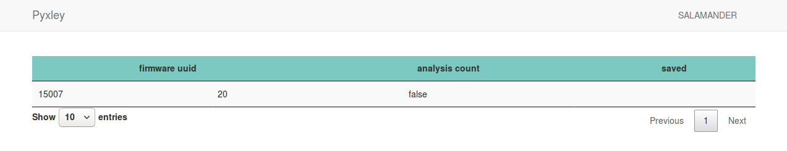

# Salamander

Salamander is a project aiming to run and test any given firmware blob dynamically in a pure software way.
Currently, we provide a modular framework to analysis a firmware under the guide of its source code. We 
will generate a new machine for QEMU, and you can play with this new machine for fun! By adding more analysis
we will get more code coverage and achieve more goals. The goal just now is to run a linux based firmware
entering the user mode and getting the shell. Let's start and enjoy our trip.


## Usage 

It might be a long time to build Salamander, and see the instructions below.

###### install python 3.7

```shell script
sudo add-apt-repository ppa:deadsnakes/ppa
sudo apt-get update
sudo apt-get install -y python3.7
sudo -H python3.7 -m pip install --upgrade pip
```

###### install required python packages

```shell script
sudo -H pip3.7 install -r requirements.txt
```

###### install dependency used by qemu

```shell script
sudo apt-get install -y git libglib2.0-dev libfdt-dev libpixman-1-dev zlib1g-dev
sudo apt-get install -y libaio-dev libbluetooth-dev libbrlapi-dev libbz2-dev
sudo apt-get install -y libcap-dev libcap-ng-dev libcurl4-gnutls-dev libgtk-3-dev
sudo apt-get install -y libibverbs-dev libjpeg8-dev libncurses5-dev libnuma-dev
sudo apt-get install -y librbd-dev librdmacm-dev
sudo apt-get install -y libsasl2-dev libsdl1.2-dev libseccomp-dev libsnappy-dev libssh2-1-dev
sudo apt-get install -y valgrind xfslibs-dev
sudo apt-get install -y libnfs-dev libiscsi-dev
sudo apt-get install -y bison flex
sudo apt-get install -y libcapstone3 libcapstone-dev
sudo apt-get install -y u-boot-tools
sudo apt-get install -y gawk
```

###### build binwalk and qemu

```shell script
sudo make clean && make
```

Before using salamander, you must prepare your firmware and provide information listed below.
+ the path to firmware [required]
+ the uuid of the firmware [required]
+ the architecture and the endian [required]
+ the brand of the firmware [required]
+ the source code to the firmware [optional]

To test your firmware, simply run your command as shown in the example. And the first run may be slow.

```shell script
./salamander.py -f /mnt/salamander/firmware/9874f62ffd1d5d1ccdfa919cc29794f03d1f08db.bin -u 14292 -a mips -e l -b openwrt -q -wd ./build
```

###### advanced  usage

+ to disable `save and restore`, please use `-r`
+ to disable `diagnosis`, please use `-q`


## Visualization

After running, it is better to have a page to show the analysis results rather than checking massive logs. Simply run
`python dashboard/__init__.py` and follow its instructions you will see the statistics of your analysis in your browser.



## Add an analysis

If the built-in analyses can not boot the kernel to its shell, you have to add your own analysis. 
More analyses you provide, more powerful the salamander will be. The visualization results will tell you what specific 
analysis you should add. The analysis you add will solve the abelia devices a kernel required. Please read 
this [paper]() to get familiar with the abelia devices and read [this](./analyses/README.md) then to understand
how we implement the analysis framework.

Once you understand what I said before, you can follow this example to add your own analysis.

###### an example

## License

