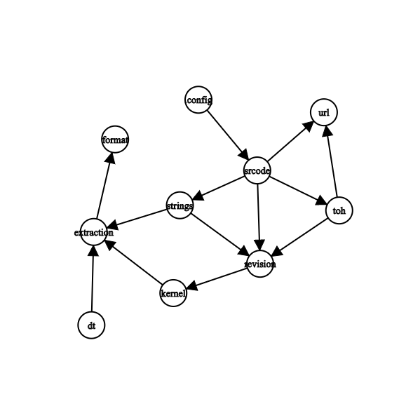

# Analysis

### Programming Model

#### Analysis

All analysis except `Analysis Group` must extend `Analysis` and set its `name`, `description`, 
`log_suffix`, `required`, and `context hint`. 
+ `name` the identification of an analysis which should be universal unique
+ `description` the description of the analysis which helps debug
+ `log_suffix` the suffix of the log of this analysis which helps debug
+ `required` **the names of analyses which must be run before this analysis**
+ `context hint` the exception hint for this analysis which helps debug
+ and put more specific requirement in `context input` to solve the exception

#### Analysis Worker

Sub-analyses run in order. Not declared explicitly.

#### Analysis Group

[WIP] Multiple analyses as a group but only one is valid. Extend `AnalysisGroup` in stead of `Analysis`.

#### Analysis Manager

Call `register_analysis` to register an analysis and call `run` to run them all. 
The details are transparent to developers and all analyses will be run in topology order according to their requirements.

### Built-in Analysis Dependency and Exception

|name|file|class|dependent on|settings|exception|
|:---:|:---:|:---:|:---:|:---:|:---:|
|format|[format.py](./format.py)|Format()|-|format, path_to_image|binwalk does not recognize this new format|
|extraction|[extraction.py](./extraction.py)|Extraction()|format|path_to_kernel, path_to_dbt|the image type is unsupported|
|kernel|[kernel.py](./kernel.py)|Kernel()|extraction|kernel_version, kernel_created_time, kernel_load_address, kernel_entry_point|-|
|dt|[device_tree.py](./device_tree)|DeviceTree()|extraction|dtc|device tree is not found|
|revision|[openwrt.py](./openwrt.py)|OpenWRTRevision()|kernel|revision|no kernel version available or no handler for this kernel version|
|strings|[strings.py](./strings.py)|Strings()|extraction, revision|toh, target, subtarget, cpu, uart, ic |-|
|url|[openwrt.py](./openwrt.py)|OpenWRTURL()|-|homepage, target, subtarget, revision|update download url for this firmware|
|toh|[openwrt.py](./openwrt.py)|OpenWRTToH()|revision, url|toh, cpu, ram, flash|-|
|srcode|[srcode.py](./srcopy.py)|SRCode()|strings, revision, url, toh|path_to_source_code|-|
|.config|[dot_config.py](./dot_config.py)|DotConfig()|srcode|cpu|-|
|check|[check.py](./check.py)|Checking()|-|-|bad bad bad trace|
|dead_loop|[dead_loop](./dead_loop)|DeadLoop()|-|-|bad bad bad trace|
|init_value|[init_value](./init_value.py)|InitValue()|-|-|very difficult program analysis|

### [Analysis Graph](https://csacademy.com/app/graph_editor/)

