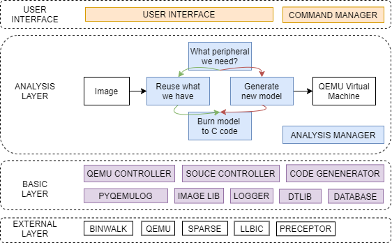

Table of Contents
=================
   * [FirmGuide internals](#firmguide-internals)
   * [Development](#development)
      * [Add subcommand](#add-subcommand)
      * [Add analysis (group)](#add-analysis-group)
      * [APIs for analysis (group)](#apis-for-analysis-group)
         * [Analysis Manager](#analysis-manager)
         * [Frimware profile getter/setter](#frimware-profile-gettersetter)

Created by [gh-md-toc](https://github.com/ekalinin/github-markdown-toc)

# FirmGuide internals



Given is the internals of FirmGuide.

Overall, FirmGuide is composed of four layers as listed in the figure.

+ User Interface

The layer of user interface eases the usage of FirmGuide by providing
many subcommands that cover detailed implementation in the bottom
layers.  The command manager is responsible for subcommand registeration
and parsing.  Please check [Add subcommand](#add-subcommand) for more
information.

+ Analysis Layer

The layer of analysis is the core part of FirmGuide. Analysis is the
smallest task to perform analysis on firmware, device tree blob, source
code analysis, and code generation. You can also put several analysis
together to form a more powerful analysis group. In the figure, we put
the basic functionality of FirmGuide to illustrate how a firmware image
is converted to a QEMU vertual machine.  Analysis manager is responsible
for analysis registration and schedual.  Please check [Add
analysis(groud)](#add-analysis-group) and [APIs for analysis
(group)](#apis-for-analysis-group) for more information.

+ Basic Layer

The layer of basics is responsible to support analysis development.  For
example, you can use `QEMU controller` to patch and compile QEMU source,
and even trace QEMU instance. 

+ External Layer
The layer of externals has other useful tools used in FirmGuide.  They
are downloaded and patched when you install FirmGuide. Their use are
transparent to users and you don't need to care them if you are
developping the basic layer.

# Development

## Add subcommand

A subcommand focuses on a specific user interface, such as uploading and
booting a firmware image.  The subcommand is registered in
`slcore/cmdconfigs`.

Here is an example of the subcommand registration.

```yaml
touch slcore/cmdconfigs/plugins/xxx.cmd.yaml
subcommand:
   help: "Subcommand help information"
   optional:
      opt1:
            short: o1
            # prop: val
   callback: lower_case_of_analysis_class_name_or_analysis_group_class_name
```

Note that the `prop` and `val` should follow the argument list in
[argparse.add_argument()](https://docs.python.org/3/library/argparse.html#argparse.ArgumentParser.add_argument).

## Add analysis (group)

An analysis focuses on a specific task, such as parsing a device tree
blob, which is the basic schedule unit in FirmGuide. Each analysis is a
Python class and all of them are put under `slcore/analysis`.  Several
analyses work together as an analysis group that is more powerful to
accomplish a complex task. The group of analysis is defined in
`slcore/aconfigs`.

Here is the template of an analysis.
```Python
# slcore/analyses/analysis_name.py
from slcore.amanager import Analysis

class AnalysisClassName(Analysis):
      def __init__(self, analysis_manager):
         super().__init__(analysis_manager)
         self.name = 'analysis_name'
         self.description = 'analysis description'
         self.required = []  # what other analysis that should be executed in advance

      def run(self):
         return True
```

Here is an example of the analysis group definition.

```yaml
# touch slcore/aconfigs/plugins/xxx.a.yaml
AnalysisGroupClassName:
   analyses: [AnalysisClassName1, AnalysisClassName2, AnalysisClassName3]
   description: 'analysis group description'
```

## APIs for analysis (group)

### Analysis Manager

```python
def run(self, **kwargs):
    # get details of the project
    self.analysis_manager.project.attrs['path']
    self.analysis_manager.project.attrs['base_dir']
    # log
    self.warning('message', 1)
    self.info('message', 1)
    self.debug('message', 1)
    # return False after setting an error information
    if False:
        self.error_info = 'error_info'
        return False
    return True
```

### Frimware profile getter/setter

```python
def run(self, **kwargs):
    self.analysis_manager.firmware.get_realdtb() # set_realdtb('path')
    self.analysis_manager.firmware.get_machine_name() # set_machine_name('plx-nas782x')
    self.analysis_manager.firmware.get_arch() # set_arch('arm')
    self.analysis_manager.firmware.get_endian() # set_endian('l')
    self.analysis_manager.firmware.get_components() # set_components(components)
    return True
```

