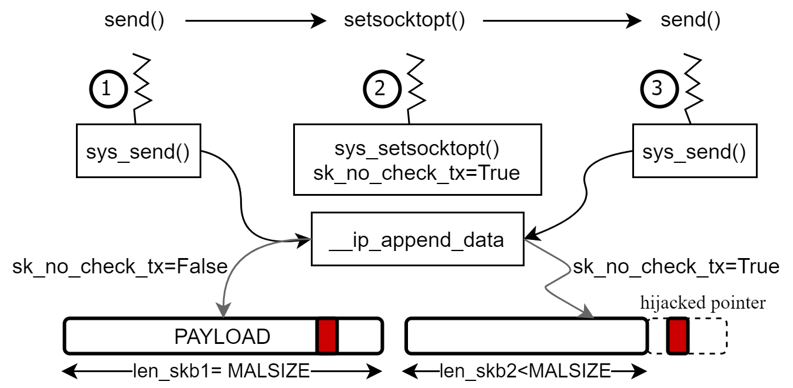
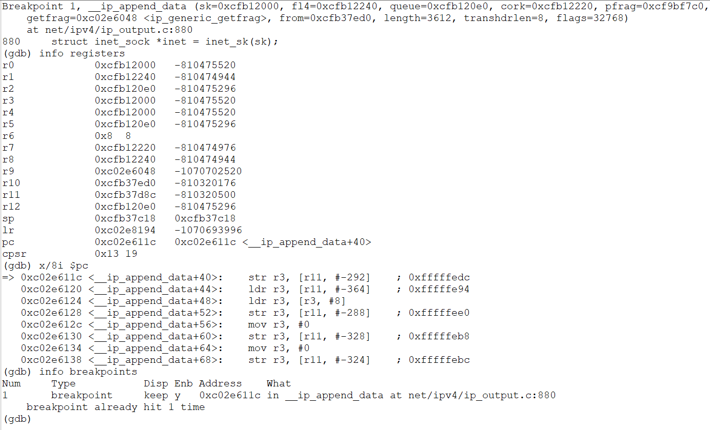
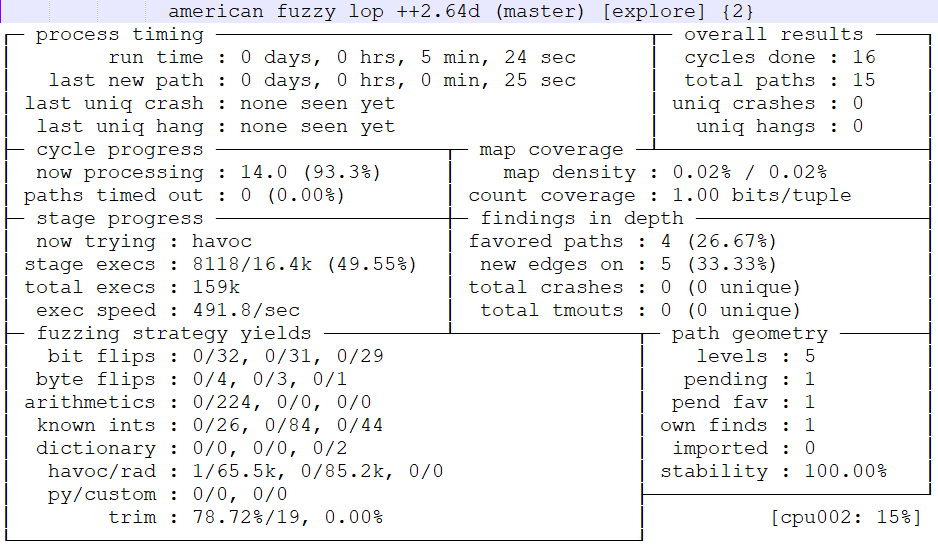
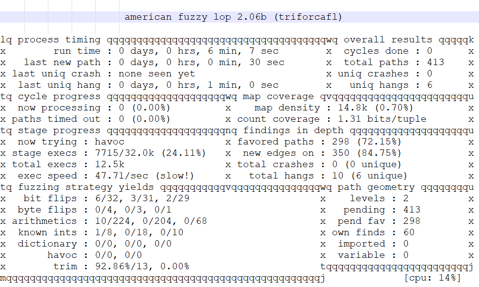

# Demo of FirmGuide

Table of Contents
=================
+ [Quick Glance](#quick-glance)
+ [Exploit of CVE-2017-100012](#exploit-of-cve-2017-100012)
+ [Usage of two fuzzing tools](#usage-of-two-fuzzing-tools)

## Quick Glance

||Subtarget|Linux kernel version of machine model|Compatible of device tree|Linux kernel version of firmware|
|:-:|:-:|:-:|:-:|:-:|
|example-01|ath79/generic|4.14.167|"comfast,cf-e120a-v3", "qca,ar9344"|4.14.162|
|example-02|ath79/generic|4.14.167|"tplink,archer-c7-v2", "qca,qca9558"|4.14.167|
|example-03|oxnas/generic|3.18.20|"plxtech,nas7820", "plxtech,nas782x"|3.18.20|
|example-04|oxnas/generic|3.18.20|"plxtech,nas7820", "plxtech,nas782x"|3.18.23|

### Highlights of 4 Examples

#### Example-01

+ The device tree of the firmware shows the SoC is "comfast,cf-e120a-v3" which is compatible with "qca,ar9344".
```
root@413131ee5739:~/example-01# # after entering the docker
root@413131ee5739:~/example-01# head B7EC64.dts
/dts-v1/;

/ {
        #address-cells = <0x1>;
        #size-cells = <0x1>;
        compatible = "comfast,cf-e120a-v3", "qca,ar9344";
        model = "COMFAST CF-E120A v3";

        interrupt-controller {
                compatible = "qca,ar7100-cpu-intc";
```

+ Boot the Linux kernel of this firmware.


+ This firmware was compiled with Linux kernel 4.14.162 on 01/06/2020.
```
# # after entering the shell
# cat /proc/version
Linux version 4.14.162 (builder@buildhost) (gcc version 7.5.0 (OpenWrt GCC 7.5.0 r10860-a3ffeb413b)) #0 Mon Jan 6 16:47:09 2020
```

#### Example-02

+ The device tree of the firmware shows the SoC is "ctplink,archer-c7-v2" which is compatible with "qca,qca9558".
```
root@413131ee5739:~/example-02# # after entering the docker
root@413131ee5739:~/example-02# head B86264.dts
/dts-v1/;

/ {
        #address-cells = <0x1>;
        #size-cells = <0x1>;
        compatible = "tplink,archer-c7-v2", "qca,qca9558";
        model = "TP-Link Archer C7 v2";

        interrupt-controller {
                compatible = "qca,ar7100-cpu-intc";
```

+ This firmware was compiled with Linux kernel 4.14.167 on 01/29/2020.
```
# # after entering the shell
# cat /proc/version
Linux version 4.14.167 (builder@buildhost) (gcc version 7.5.0 (OpenWrt GCC 7.5.0 r10911-c155900f66)) #0 Wed Jan 29 16:05:35 2020
```

+ Boot the Linux kernel of this firmware.


#### Example-03

+ The device tree of the firmware shows the SoC is "plxtech,nas7820" which is compatible with "plxtech,nas782x".
```
root@413131ee5739:~/example-03# # after entering the docker
root@413131ee5739:~/example-03# head 379B54.dts
/dts-v1/;

/ {
        #address-cells = <0x1>;
        #size-cells = <0x1>;
        compatible = "plxtech,nas7820", "plxtech,nas782x";
        interrupt-parent = <0x1>;
        model = "MitraStar Technology Corp. STG-212";

        chosen {
```

+ Boot the Linux kernel of this firmware.


+ This firmware was compiled with Linux kernel 3.18.20 on 09/04/2015.
```
# # after entering the shell
# cat /proc/version
Linux version 3.18.20 (buildbot@builder1) (gcc version 4.8.3 (OpenWrt/Linaro GCC 4.8-2014.04 r46450) ) #2 SMP Fri Sep 4 18:53:52 CEST 2015
```

#### Example-04

+ The device tree of the firmware shows the SoC is "plxtech,nas7820" which is compatible with  "plxtech,nas782x".
```
root@413131ee5739:~/example-04# # after entering the docker
root@413131ee5739:~/example-04# head 39F784.dts
/dts-v1/;

/ {
        #address-cells = <0x1>;
        #size-cells = <0x1>;
        compatible = "plxtech,nas7820", "plxtech,nas782x";
        interrupt-parent = <0x1>;
        model = "Pogoplug Pro";

        chosen {
```

+ Boot the Linux kernel of this firmware.


+ This firmware was compiled with Linux kernel 3.18.23 on 01/31/2016.
```
# # after entering the shell
# cat /proc/version
Linux version 3.18.23 (buildbot@builder1) (gcc version 4.8.3 (OpenWrt/Linaro GCC 4.8-2014.04 r47269) ) #2 SMP Sun Jan 31 13:47:55 CET 2016
```

## Exploit of CVE-2017-100012



We use FirmGuide to analyze how to exploit
CVE-2017-1000112.

+ ① Call the *send*
syscall with **PAYLOAD** of
**MALSIZE** as well as **MSG\_MORE** flag,
leading subsequent packet processing from
*\_\_ip\_append\_data()* to
*ip\_ufo\_append\_data()*.
+ ② Call the *setsockopt* syscall to set
**sk\_no\_check\_tx**.
+ ③ Call the *send* syscall with arbitrary data.
Because **sk\_no\_check\_tx** is set, the
erroneous condition checking in
*\_\_ip\_append\_data()* switches processing
from *ip\_ufo\_append\_data()* (the UFO path)
to local main loop (the non-UFO path). As
**skb\_prev->len**
controlled by **MALSIZE** is larger than the
size non-UFO processing can offer, an heap
overflow takes place in
*skb\_copy\_and\_csum\_bits()*, and a code
pointer is hijacked by the attacker with the
malicious **PAYLOAD**. 

Finally, the attack
can launch the root shell after successfully
elevating the privilege. To facilitate the
development of the kernel exploit, we leverage
GDB to debug the rehosted Linux kernel.



## Usage of Two Fuzzing Tools

We ported two fuzzing tools, i.e., UnicoreFuzz
and TriforceAFL to demonstrate the usage of
FirmGuide. The following two figures show the
running status of UnicoreFuzz and TriforceAFL,
respectively.




